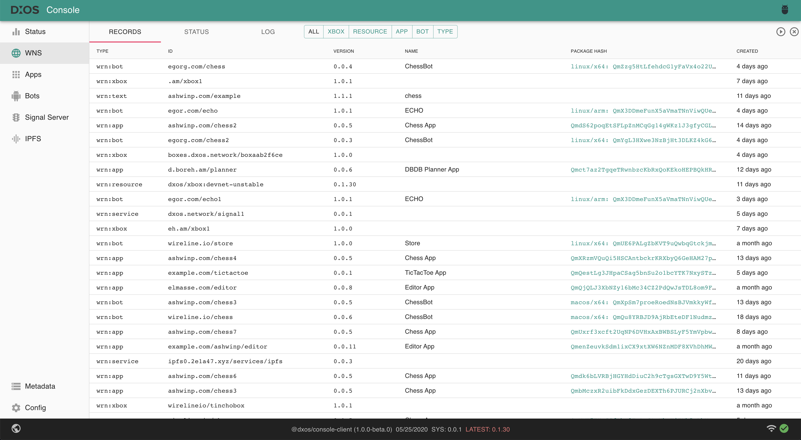

# Konsole App

[DXOS Konsole App](./packages/konsole-app) displays various kinds of meta and state information about DXOS.

See its [storybook](https://609d2a9c8202250039083fbb-qzdizbgwmn.chromatic.com/?path=/story/panels--records).

Live demo is available [here](https://enterprise.kube.dxos.network/app/marcin:app.konsole).

# Legacy console

There is [a legacy console](./packages/console-app) project kept here for reference.
When [the current console](./packages/konsole-app) gets corresponding features,
then we may remove the legacy from this repo.

DXOS Kubenet GraphQL server and console application.

